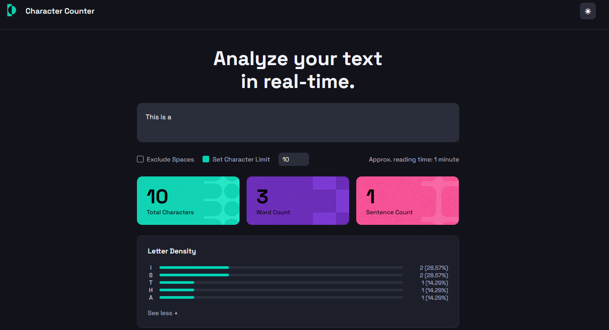
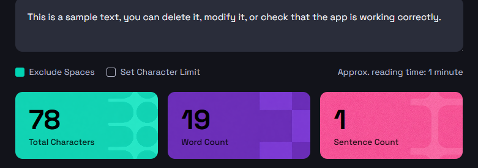
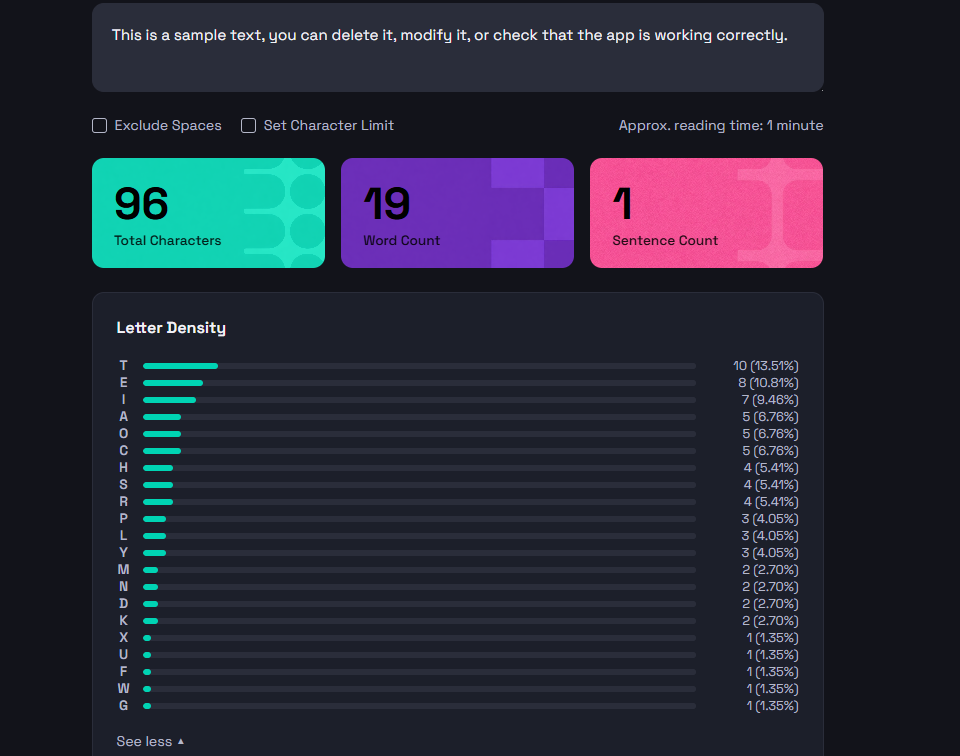
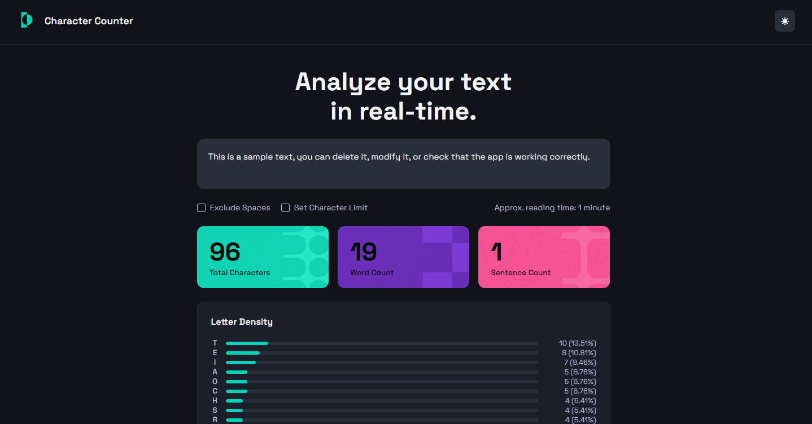
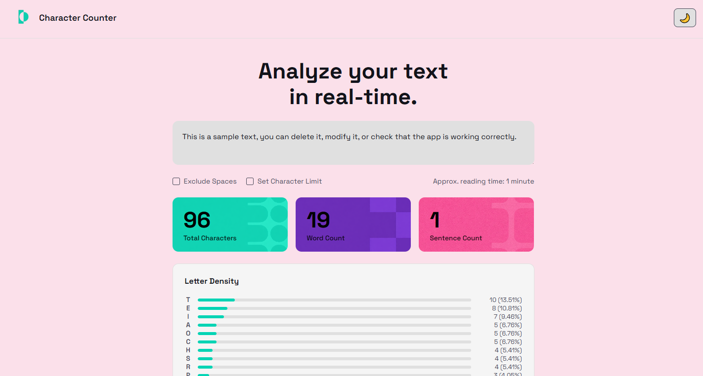
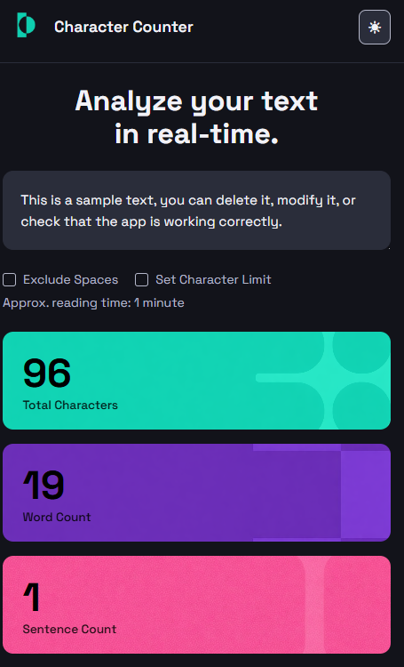
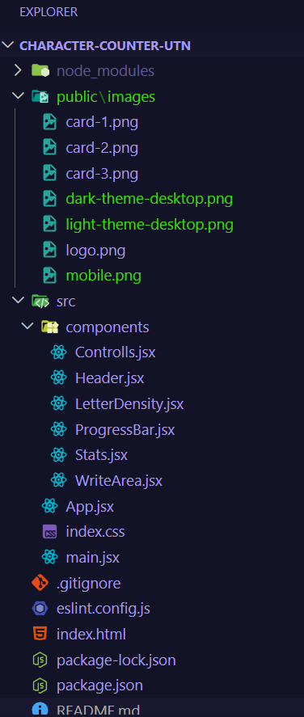

# Character Counter

## 1. Objetivo del proyecto

Desarrollar una aplicación web funcional de conteo de caracteres utilizando React y JavaScript, como segunda etapa del proyecto. La app analiza texto en tiempo real contando caracteres, palabras y oraciones, calcula el tiempo aproximado de lectura, muestra la densidad de letras y permite configurar opciones como excluir espacios o establecer un límite de caracteres. Incluye además modo claro y oscuro con persistencia en localStorage.

## 2. Tecnologías utilizadas

- **React** — biblioteca principal para la construcción de la UI por componentes
- **JavaScript (ES6+)** — lógica de la aplicación y manejo de estado
- **Vite** — entorno de desarrollo y bundler
- **CSS3** — estilos, variables CSS, Flexbox y responsive design
- **Google Fonts** — tipografía Space Grotesk
- **Remove.bg** — para remover el fondo del logo
- **Microsoft Copilot** — para la generación de las imágenes decorativas de las cards
- **Netlify** — deploy de la aplicación

## 3. Cómo organicé los componentes

La aplicación está estructurada en componentes dentro de `src/components/`:

- **`Header`** — logo, nombre del sitio y botón de cambio de tema (☀ / 🌙)
- **`WriteArea`** — textarea controlada donde el usuario escribe el texto
- **`Controlls`** — checkboxes de opciones (Exclude Spaces, Set Character Limit) y tiempo de lectura aproximado
- **`Stats`** — tarjetas de métricas (Total Characters, Word Count, Sentence Count)
- **`LetterDensity`** — sección de densidad de letras con botón "See more / See less"
- **`ProgressBar`** — barra de progreso individual para cada letra

Todo el estado se maneja en `App.jsx` y se pasa hacia abajo mediante props.

## 4. Cómo resolví el CSS

El archivo `index.css` está organizado en el siguiente orden:

1. Reset general (`*`)
2. Variables CSS (`:root`) — tema oscuro por defecto
3. Tema claro (`body.light-theme`) — sobreescribe solo las variables que cambian
4. Estilos del `body`
5. Estilos por componente en el mismo orden que la UI
6. Media queries al final para responsive mobile

El sistema de temas usa variables CSS: `:root` define el tema oscuro por defecto y `body.light-theme` sobreescribe las variables de color. La clase se aplica dinámicamente desde React con `document.body.className`. La preferencia se persiste en `localStorage`.

Las barras de progreso se implementaron con el elemento nativo `<progress>`, estilizado con pseudo-elementos específicos por navegador (`-webkit` para Chrome/Safari y `-moz` para Firefox).

## 5. Dificultades encontradas

- **Imágenes de fondo de las cards** — las imágenes decorativas tenían el color de fondo incluido, por lo que Remove.bg no podía removerlo correctamente. Se resolvió reemplazando las imágenes por versiones corregidas.

- **Sistema de temas** — las variables CSS definidas en `main` no afectaban al `header` ni al `body` por estar fuera de ese elemento. Se resolvió aplicando la clase al `body` directamente desde React con `document.body.className`.

- **Ícono "See more"** — el símbolo `v` no quedaba alineado verticalmente. Se reemplazó por el triángulo Unicode `▼` con `font-size: 0.5rem`.

- **Símbolo `<` en JSX** — en la etapa anterior se usaba `&lt;` en HTML. En React el símbolo `<` se puede escribir directamente en JSX dentro de strings, por ejemplo `"< 1 minute"`.

## 6. Funcionalidades

- Conteo en tiempo real de caracteres, palabras y oraciones
- Opción para excluir espacios del conteo de caracteres
- Límite de caracteres configurable. Se agrega funcionalidad de cvovler al límite original.
- Tiempo aproximado de lectura (200 palabras por minuto)
- Densidad de letras con barras de progreso y opción "See more / See less"
- Modo claro / oscuro con persistencia en localStorage

## 7. Deploy

🔗 [Ver aplicación en Netlify](https://character-counter-utn.netlify.app/) 

## 8. Capturas del resultado final

### Función aplicar límite de caracteres

### Función excluir espacios

### Función "ver más"

### Vista desktop — tema oscuro

### Vista desktop — tema claro

### Vista mobile

### Estructura del proyecto en VSCode

---
#### Proyecto desarrollado por Sofía De Alessandre - Agosto 2026.